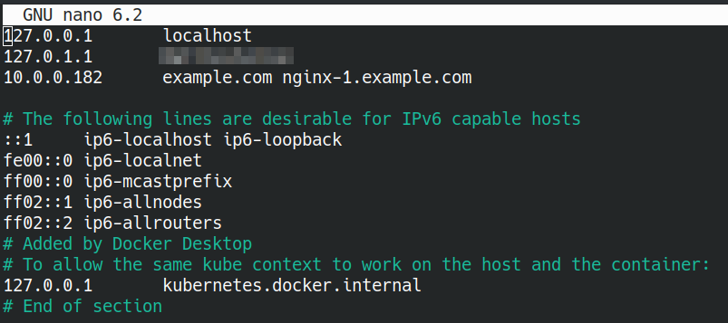
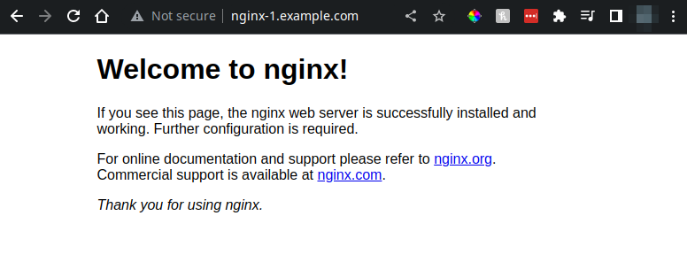

# Kubernetes Learning Series: Workshop

## Prerequistes
- [K|X|L]Ubuntu 22.04 LTS or Using Ubuntu Server 22.04 LTS 
- Use of **K3S**
- Established SSH Connection to Server that K3S will live on. 


### (Optional) Setting up Fish Shell 
> Fish is a shell for Linux, MacOS or WSL2 that includes autocompletion and information for commands. 

1. Install Fish 
    ```bash
    sudo apt update && sudo apt install -y fish
    ```
1. Enter Fish in the  
    ```bash 
    fish
    ```
1. Set Fish as your default shell 
    ```bash
    chsh -s /usr/bin/fish
    ```
1. Check if config file exists, if not create one
    ```bash 
    nano ~/.config/fish/config.fish #This will throw a error if file doesn't exist
    ```
    ```
    mkdir -p ~/.config/fish

    nano ~/.config/fish/config.fish
    ```
## Setting up Variables
> In Linux the tilda `~` references the home directory aka `/home/$USER`

We will be setting up permanaent environment variables for the Domain, email of the user and the location of the KUBECONFIG for k3s. 

#### bash
``` 
nano ~/.profile
#Add the following line to the bottom of the file: 
    export DOMAIN=example.com
    export EMAIL=name@example.com
    export KUBECONFIG=/etc/rancher/k3s/k3s.yaml 
```
To save the file press `Ctrl + x` to save, `Y` to confirm changes and then `Enter` to save changes to the file. 

Then to make these variables live in the current shell environment run `. ~/.profile`. This is forcing the profile script the runs on login to run again. 

#### fish 
```
set -Ux DOMAIN example.com
set -Ux EMAIL name@example.com
set -Ux KUBECONFIG /etc/rancher/k3s/k3s.yaml 
```

### Install pieces needed for Longhorn and Wireguard
```
sudo apt update && \
sudo apt upgrade -y && \ 
sudo apt install open-iscsi wireguard -y
```

### Setup Arkade, Heml and Kubectl autocomplete
The following section installs the Arkade and then uses Arkade to install the other tools. Helm will be used to download per configured Kubernetes Apps/environments and kubectl is the management tool. 

```
curl -sLS https://dl.get-arkade.dev | sh
sudo cp arkade /usr/local/bin/arkade 
arkade get helm
sudo cp ~/.arkade/bin/helm /usr/local/bin/ 
arkade get kubectl
sudo mv ~/.arkade/bin/kubectl /usr/local/bin/ 
```
### Add kubectl autocompletion
bash
```
source <(kubectl completion bash) && \
echo 'source <(kubectl completion bash)' >> ~/.bashrc
```

fish 
```
echo "kubectl completion fish | source" >> ~/.config/fish/config.fish
```

## Installing k3s and setting up main agent. 
> In this guide we are not setting a single node. It is suggested to have multiple worker nodes to have a high availablity cluster. 

Normally k3s installations come with Traefik installed, while it normally works out of the box, we will switch to using the Nginx Ingress controller.


```
curl -sfL https://get.k3s.io | INSTALL_K3S_VERSION=v1.23.5+k3s1 sh -s server \
--cluster-init \
--flannel-backend=wireguard \
--write-kubeconfig-mode 644 \
--no-deploy traefik
```

Verify that your deployment is running with 
```
kubectl get nodes
```
You should see 
```
NAME        STATUS   ROLES                       AGE     VERSION
kube-demo   Ready    control-plane,etcd,master   2m15s   v1.23.5+k3s1
```

Then confirm that all services are running
```
$ kubectl get services --all-namespaces
NAMESPACE     NAME             TYPE        CLUSTER-IP   EXTERNAL-IP   PORT(S)                  AGE
default       kubernetes       ClusterIP   10.43.0.1    <none>        443/TCP                  2m55s
kube-system   kube-dns         ClusterIP   10.43.0.10   <none>        53/UDP,53/TCP,9153/TCP   2m53s
kube-system   metrics-server   ClusterIP   10.43.82.2   <none>        443/TCP                  2m52s

```
Now use `kubectl` to add the kubernetes config to your profile on the server. This will be used by helm. 

```
kubectl config view --raw > ~/.kube/config
```
### Install the Nginx Controller
Since we used `--no-deploy traefik` in the previous command we don't have a Ingress controller currently running. In this section we will install the Nginx controller. 

### Create the namespace for ingress-nginx
```
kubectl create namespace ingress-nginx
```

### Add nginx repository to helm
```
helm repo add ingress-nginx https://kubernetes.github.io/ingress-nginx
helm repo update
```

### Install nginx ingress controller

```  
helm install ingress-nginx ingress-nginx/ingress-nginx --version="4.0.17" \
--set rbac.create=true \
--set controller.kind=DaemonSet \
--set controller.service.type=LoadBalancer \
--set controller.service.externalTrafficPolicy=Local \
--set controller.publishService.enabled=true \
--set defaultBackend.enabled=true \
--set enable-prometheus-metrics=true \
--namespace ingress-nginx
```

Run the command to get services and specify the `ingress-nginx` namespace and you should see the Nginx Controller added
```
$ kubectl get services -n ingress-nginx
NAME                                 TYPE           CLUSTER-IP      EXTERNAL-IP   PORT(S)                      AGE
ingress-nginx-controller             LoadBalancer   10.43.113.65    10.0.0.182    80:31263/TCP,443:32658/TCP   26m
ingress-nginx-controller-admission   ClusterIP      10.43.114.70    <none>        443/TCP                      26m
ingress-nginx-defaultbackend         ClusterIP      10.43.128.227   <none>        80/TCP                       26m

```


## Download repo
Install git on your server for direct access to the repo. 
```
sudo apt install git -y 
```

Download the repo onto the server
```
git clone https://github.com/evcwilson/kube_learning_workshop.git
```

Move into the nginx directory
```
cd kube_learning_workshop/nginx/
```
## Creating your first deployment
If you have followed everything to this point, if you run `echo $DOMAIN` you should see your DOMAIN variable printed out e.g. `example.com`. 

We will run through the files to create the Namespace `nginx-demo`, the Service, the Deployment and finally the Ingress Resource.

We will use the environment variable substitution method. 

```
cat [filename].[ext] | envsubst | kubectl apply -f - 
```

1. Create the namespace
    ```
    $ cat 01-namespace.yaml | envsubst | kubectl apply -f - 
    namespace/nginx-demo created
    ```
1. Create the Service
    ```
    $ cat 02-service.yaml | envsubst | kubectl apply -f - 
    service/nginx-1-service created
    ```
1. Create the Deployment 
    ```
    $ cat 03-deployment.yaml | envsubst | kubectl apply -f - 
    deployment.apps/nginx-1 created
    ```
1. Create the Ingress Resource
    ```
    $ cat 04-ingress.yaml | envsubst | kubectl apply -f - 
    ingress.networking.k8s.io/nginx-01 created
    ```
### Viewing your deployment
We will now edit the hosts file on your host machine. 

#### [Windows](https://pureinfotech.com/edit-hosts-file-windows-11/#:~:text=To%20edit%20the%20%E2%80%9CHosts%E2%80%9D%20file,0.1%20domain.com%20)

#### Linux
In the terminal
```bash
sudo nano /etc/host
#Add the following line to the file
    [IP Of Kubernetest Server]     example.com nginx-1.example.com
```

Once your are finished the file should look something like this


Then navigate to `nginx-1.[Your Domain]` in the browser and you should see. 


## Download and Install Lens 
On your Windows Installation: 

Visit the [Lens Website](https://k8slens.dev/) to install Lens (free for personal use) or use the following guide to install [OpenLens](https://blog.devgenius.io/is-it-time-to-migrate-from-lens-to-openlens-75496e5758d8)

Connect to Kubernetes Server
Run the following command to get the k3s configuration
```bash
cat /etc/rancher/k3s/k3s.yaml
```
This is the default location for K3s install

Copy into Lens Kubeconfig edit section
Change Ip address from localhost to external IP
```yaml
apiVersion: v1
clusters:
- cluster:
    certificate-authority-data: LS0...
    server: [Change This Here to IP address]:6443
  name: default
contexts:
```
